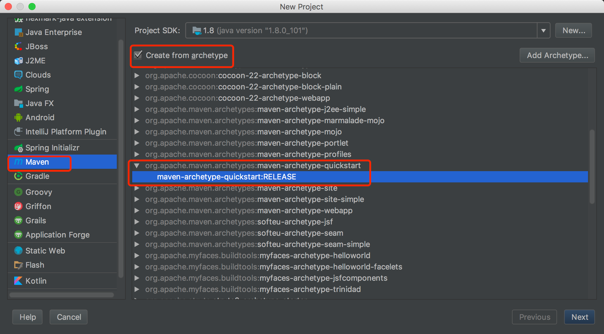

IDEA Maven 创建 Spring 项目
=======================
####  选择`File -> New -> Project`,然后如图选择`Maven`,如图操作

#### 新建完成后，在pom.xml添加依赖
```xml
    <dependencies>
        ...
        <dependency>
            <groupId>org.springframework</groupId>
            <artifactId>spring-context</artifactId>
            <version>5.0.5.RELEASE</version>
        </dependency>
    </dependencies>
```
